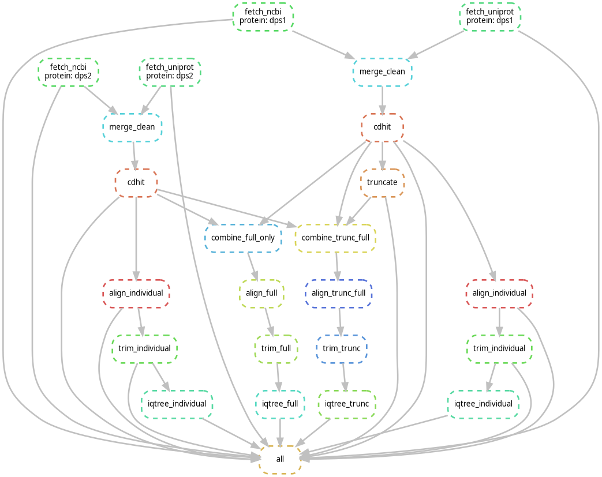

# # DPS Phylogeny Pipeline

**Automated and reproducible workflow for the retrieval, curation, alignment, phylogenetic analysis, and sequence identity visualization of Dps proteins in *Deinococcus* species.**

Built with Snakemake and executed inside a Docker container — no manual steps, fully portable.

---

## Overview

This pipeline analyzes **Dps1** and **Dps2** proteins from *Deinococcus* species, with a special focus on *Deinococcus radiodurans*. It covers everything from sequence retrieval to phylogenetic tree inference and sequence identity heatmap generation.

Two complementary phylogenetic analyses are performed:
- **Truncated + Full dataset** — combines full-length sequences with truncated Dps1 (aa 54–207), focusing on the conserved domain
- **Full-length only dataset** — uses complete sequences for a global evolutionary view

---

## Features

- **Single-command execution** via Snakemake
- **Multi-database retrieval** from NCBI and UniProt
- **Automated preprocessing** — deduplication, filtering, CD-HIT redundancy reduction
- **Dps1 truncation** — extracts the conserved region (aa 54–207)
- **Phylogenetic inference** with MAFFT + TrimAl + IQ-TREE (model selection, bootstrap, aLRT)
- **Sequence identity heatmap** — pairwise identity matrix visualized as a heatmap
- **Containerized** — Docker ensures identical behaviour across systems
- **CI/CD** — GitHub Actions dry-run and DAG validation on every commit

---

## Installation

**Requirements:** Snakemake and Apptainer (Singularity)

```bash
# 1. Install Snakemake
conda install -c conda-forge -c bioconda snakemake

# 2. Install Apptainer (Ubuntu)
# Download apptainer_1.4.5_amd64.deb from https://github.com/apptainer/apptainer/releases/tag/v1.4.5
sudo apt install ./apptainer_1.4.5_amd64.deb

# 3. Clone the repo
git clone https://github.com/yourname/dps_phylogeny_pipeline.git
cd dps_phylogeny_pipeline

# 4. Run
snakemake --use-singularity --cores 4
```

The container image (`docker://filipafernandes/dps_pipeline:006`) is pulled automatically.

---

## Configuration

All pipeline behaviour is controlled via `config.yaml`:

```yaml
proteins:
  - dps1
  - dps2

taxon: "Deinococcus"
focus_species: Deinococcus radiodurans

min_length: 150
max_length: 300

cdhit_identity: 0.95
email: youremail@example.com
retmax: 500
```

| Parameter | Description |
|---|---|
| `proteins` | Target proteins to search |
| `taxon` | Taxonomic group for retrieval |
| `min/max_length` | Sequence length filter |
| `cdhit_identity` | CD-HIT clustering threshold |
| `truncations` | Per-protein truncation coordinates |
| `iqtree.bootstrap` | Ultrafast bootstrap replicates |
| `email` | Required for NCBI Entrez API |

---

## Pipeline Steps

| Step | Tool | Output |
|---|---|---|
| Sequence retrieval | Biopython / UniProt REST | `data/raw/` |
| Merge & clean | Custom script | `data/cleaned/` |
| Redundancy reduction | CD-HIT (≥95% identity) | `data/cleaned/*/nonredundant.fasta` |
| Dps1 truncation | Custom script | `data/cleaned/dps1/dps1_trunc.fasta` |
| Dataset construction | — | `data/combined/` |
| Multiple alignment | MAFFT L-INS-i | `data/aligned/` |
| Alignment trimming | TrimAl `-automated1` | `data/aligned/*_trimmed.fasta` |
| Phylogenetic inference | IQ-TREE2 (`-m MFP -B 1000 --alrt 1000`) | `data/trees/` |
| Sequence identity heatmap | seaborn / pandas | `data/heatmap/` |

---

## Output Structure

```
data/
├── raw/            # Retrieved sequences (NCBI + UniProt)
├── cleaned/        # Filtered, non-redundant, and truncated sequences
├── combined/       # Merged datasets (trunc+full and full-only)
├── aligned/        # MAFFT alignments and TrimAl-trimmed versions
├── trees/          # IQ-TREE treefiles (individual, trunc, full)
└── heatmap/
    ├── sequence_identity.csv   # Pairwise identity matrix
    └── sequence_identity.png   # Heatmap visualization
```

---

## DAG



Generate your own:
```bash
snakemake --dag | dot -Tpng > dag.png
```

---

## Reproducibility

- Snakemake handles rule dependencies and reruns only what's needed
- Docker container pins all tool versions
- `config.yaml` makes the pipeline reusable for any protein/taxon

---

## References

- **Snakemake** — Köster & Rahmann, *Bioinformatics* 2012
- **Biopython** — Cock et al., *Bioinformatics* 2009
- **MAFFT** — Katoh & Standley, *Mol Biol Evol* 2013
- **TrimAl** — Capella-Gutiérrez et al., *Bioinformatics* 2009
- **IQ-TREE** — Minh et al., *Mol Biol Evol* 2020
- **CD-HIT** — Li & Godzik, *Bioinformatics* 2006

---

## Contact

**Filipa Fernandes** — Bioinformatics Student
📧 [filipaifernandes.2005@gmail.com](mailto:filipaifernandes.2005@gmail.com)
